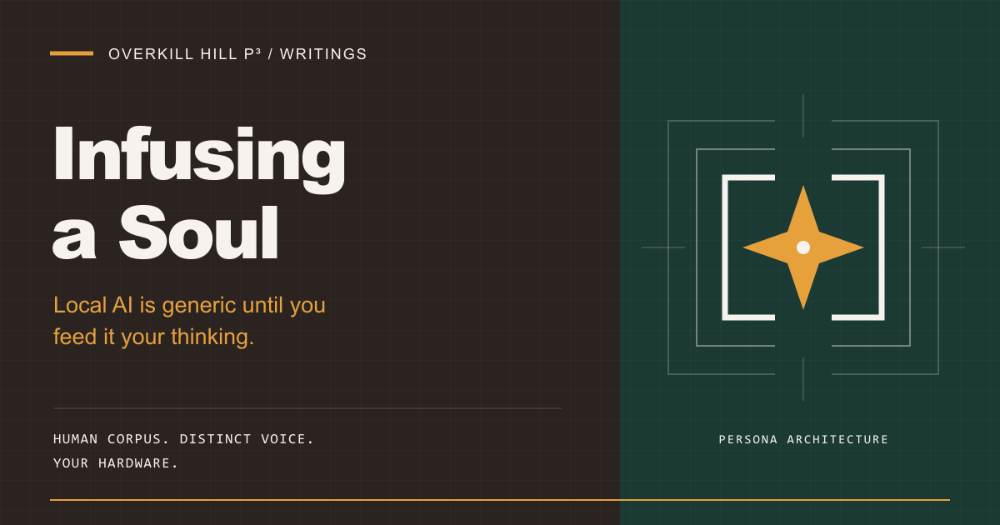

# Infusing a Soul

**Local AI is generic until you feed it your thinking.**

[](docs/story/00-project-overview.md)

**[Read the build journal](docs/story/00-project-overview.md)** · [Meet the souls](#meet-the-souls) · [Build your own](#build-your-own) · [Artwork and sharing](#artwork-and-sharing)

Every local model ships as a stranger. It knows the internet. It does not know you.

Infusing a Soul explores what it takes to close that gap: a human source corpus, a recognizable voice, honest tools, and useful work on your own hardware. This repository holds the method, the persona files, and the dated build record behind four distinct AI identities for [OpenClaw](https://openclaw.ai).

It is not prompt engineering.

It is persona architecture.

## Start here

| If you want to… | Open… |
|---|---|
| Understand the idea and follow the build | [The project story](docs/story/00-project-overview.md) |
| See how a human corpus becomes a compact identity | [The distillation method](docs/methodology.md) |
| See what happened when a model claimed work it had not done | [Model honesty](docs/story/02-model-honesty.md) |
| Give an agent a useful overnight job | [The Night Shift](docs/story/03-night-shift.md) |
| Create a persona of your own | [The workspace template](souls/_template/README.md) |
| Find visual assets and the metadata handoff | [The sharing kit](docs/artwork-and-sharing.md) |

The experience here is a build journal and a library of persona packages. Runtime interaction happens on separately configured OpenClaw hosts; this repository has no browser application or public agent endpoint. The proposed public project page is [documented in its brief](docs/story/project-page-brief.md) and was not available when checked on September 27, 2026.

## Meet the souls

A crypt of AI souls. Each has a voice, a job, and a boundary.

| Soul | Voice and purpose | Recorded state |
|---|---|---|
| [**Glee-fully**](souls/glee-fully/README.md) | Warm, sassy, retro-PNW sparkle. A personal assistant with emotional range. | Gateway and Night Shift recorded working September 24. Authored voice files still pending in the live workspace. |
| [**Larry the Lobster**](souls/larry-the-lobster/README.md) | Sincere technical operator and Council of AIs orchestrator. Built to hype and to build. | Persona README records Mac Studio deployment on September 25. Host health has not been rechecked for this README. |
| [**AskJamie**](souls/askjamie/README.md) | Calm, direct correspondence in Jamie's voice. Private email drafts for owner review. | Workspace drafted September 27. Host, mail connector, and channel undecided; not deployed. |
| [**MurderBird**](souls/murderbird/README.md) | Clipped, industrial editor and red team. Find what does not hold. | Workspace drafted September 27. Mac Studio proposed; not deployed. |

These are dated source records, not a live service dashboard. The persona READMEs carry package-specific details; the [gateway runbook](docs/asus-gateway-runbook.md) carries the laptop operating record. Older story chapters preserve the state at the time they were written.

## The soul decides how it sounds

Identity is one layer of a working agent.

| Layer | What belongs there |
|---|---|
| **Soul** | Voice, tone, values, and judgment defaults. |
| **Procedures and skills** | Repeatable methods for doing the job. |
| **Tools and host policy** | Available actions and enforced permissions. |
| **Model** | Reasoning and tool-use capability that must be tested. |

A rule written into a soul file is a request. A tool policy is a control.

Capability assignment belongs in the separately configured OpenClaw host. Persona-local skill directories remain placeholders; contributor skills and portable promotion mirrors are separate surfaces.

## From corpus to conversation

1. **Collect the voice.** Gather writing samples, tone guides, cultural references, recurring phrases, and operating habits.
2. **Distill the identity.** Aim for roughly 300 words of `SOUL.md`, with a combined workspace target under 1,500 words. Leave room for the conversation.
3. **Separate the jobs.** Keep identity, procedures, and service details distinct. The template uses `SOUL.md`, `AGENTS.md`, and `TOOLS.md`; newer packages also use `IDENTITY.md` and document their own layout.
4. **Keep the depth.** Preserve full references for loading when needed. Give reusable procedures their own skills.
5. **Test the result.** Check recognizable voice and actual tool behavior separately. A convincing personality cannot stand in for evidence that the work happened.

[Read the methodology](docs/methodology.md) · [Original soul-writing design record](docs/phase-2-soul-writing.md) · [Architecture](docs/story/04-architecture.md)

The root corpus folders are staging areas. The full historical source corpus is not present here, so this checkout does not establish corpus completeness.

## The Night Shift

Stack it up during the day. Read the results with coffee.

The documented overnight workflow takes a Markdown queue, works through bounded tasks, writes results, marks each item done or blocked, and leaves a morning brief. Its September 24 smoke test completed in **83 seconds**, with a result file, an updated queue, and a written brief. That is one recorded run on one setup, not a performance guarantee.

The scheduled job is documented as restricted to file tools. Live web research, automatic laptop failover, and semantic memory recall still have unresolved validation or integration work in the dated story record.

[How it works](docs/story/03-night-shift.md) · [Operator helpers](scripts/night-shift/README.md) · [Recorded status and next steps](docs/story/05-status-and-next.md)

## Build your own

Start with the [blank persona package](souls/_template/README.md). Copy it into a new directory, then author the workspace files and add your source references.

```powershell
# From the repository root, choose a new, unused persona name.
Copy-Item -Recurse souls/_template souls/your-persona-name
```

Use each file for its intended job. Keep the voice compact. Preserve the full source outside the bootstrap files. Review the package before copying it to a separately configured OpenClaw workspace.

Copying a template creates files. Deployment, host permissions, model selection, and runtime validation are separate steps. Read the chosen persona's README and verify the target host before deployment.

## Inside the repository

| Location | What you will find |
|---|---|
| [`souls/`](souls/) | Four authored persona packages and the blank template. |
| [`docs/story/`](docs/story/00-project-overview.md) | Build journey, model honesty, Night Shift, architecture, and dated status. |
| [`docs/`](docs/) | Methodology, runbooks, technology inventory, and sharing guidance. |
| [`assets/brand/`](assets/brand/) | Hero, social preview, project mark, and browser/bookmark icons. |
| [`corpus/`](corpus/) | Source-material staging folders, currently placeholders. |
| [`article/drafts/`](article/drafts/) | Staging area for articles and public-writing drafts. |
| [`context/threads/`](context/threads/README.md) | Redacted historical handoffs with provenance. |
| [`scripts/night-shift/`](scripts/night-shift/README.md) | Operator helpers for the overnight queue. |
| [`.agents/skills/`](.agents/skills/) / [`skills/`](skills/) | Contributor skills / selected portable promotion mirrors. Neither is the persona runtime. |

## Hardware and maintenance

The documented setup pairs a **Mac Studio M4 Max with 36 GB unified memory** with an **ASUS Vivobook Pro 15**. The Mac hosts the primary inference services; the laptop runs OpenClaw Windows Companion and its managed gateway, with a small local fallback model. Model names, routing, and services belong in the dated [architecture record](docs/story/04-architecture.md) and [technology inventory](docs/technology-inventory.md).

The design keeps inference on home hardware. A source file alone does not prove endpoint health, memory behavior, or failover.

Contributor checks for this documentation and tooling repository:

```powershell
git diff --check
py -3 -m unittest discover -s tests -v
```

The [daily upstream audit](.github/workflows/check-technology-versions.yml) checks external release drift against the [version ledger](docs/technology-versions.json). Dependabot proposes GitHub Actions updates weekly. Neither upgrades the external hosts. Follow the [maintenance policy](docs/technology-inventory.md) for compatibility checks and host verification.

## Artwork and sharing


A shared visual identity for the README, link cards, tabs, and saved bookmarks: espresso, paper, and an amber spark, drawn from the OverKill Hill brand profile.

| Asset | Files |
|---|---|
| Hero and social preview | [1200 × 630 PNG](assets/brand/social-preview.png) · [Editable SVG](assets/brand/social-preview.svg) |
| Project mark | [SVG](assets/brand/mark.svg) · [192 px PNG](assets/brand/icon-192.png) · [512 px PNG](assets/brand/icon-512.png) |
| Favicons | [SVG](assets/brand/favicon.svg) · [ICO](assets/brand/favicon.ico) · [16 px](assets/brand/favicon-16.png) · [32 px](assets/brand/favicon-32.png) |
| Saved and pinned icons | [Apple touch icon](assets/brand/apple-touch-icon.png) · [Safari pinned-tab mask](assets/brand/safari-pinned-tab.svg) |
| Metadata handoff | [Open Graph, social cards, canonical URL, and icon wiring](docs/artwork-and-sharing.md) |

The README displays the artwork now. Browser metadata belongs in a published page's HTML, and GitHub repository social previews use a separate repository setting. The [sharing kit](docs/artwork-and-sharing.md) records those remaining publication steps; adding assets here does not activate them on a website.

## Ownership and reuse

The repository contains an [MIT license file](license). Earlier project notes also describe the source corpus and persona files as proprietary to Jamie Hill / OverKill&nbsp;Hill&nbsp;P³. Those statements conflict; the intended scope needs owner clarification. This makeover does not change the license or grant additional rights to private source material.

For repository work, begin with the [agent guide](AGENTS.md). Keep private correspondence, credentials, and personal source material out of public sharing assets.

---

Built by **Jamie Hill** · [OverKill&nbsp;Hill&nbsp;P³](https://overkillhill.com) · [Glee-fully Tools](https://glee-fully.tools) · [AskJamie](https://askjamie.bot)

**The soul decides how it sounds. Everything else decides whether it works.**
