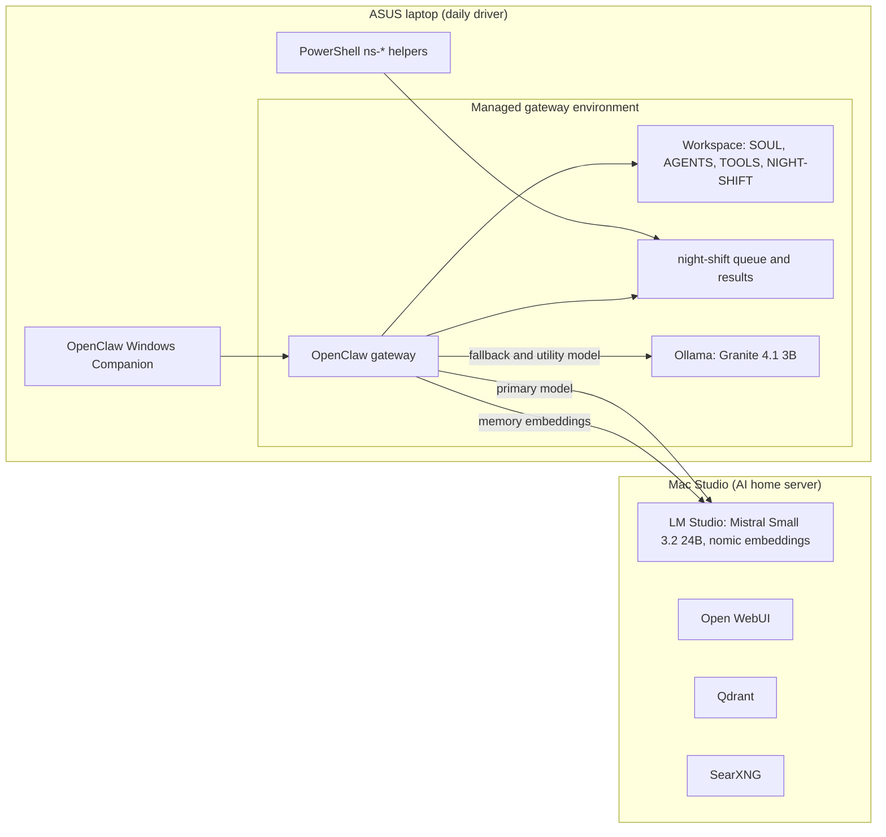

# Architecture

Two machines. One agent. Every token stays in the house.

## Topology

## Model routing

| Role | Model | Host | Notes |
|---|---|---|---|
| Primary | Mistral Small 3.2 24B | Mac Studio | Passed the honesty test |
| Fallback | Granite 4.1 3B | Laptop GPU | Takes over when the Mac is unreachable |
| Utility | Granite 4.1 3B | Laptop GPU | Session titles and progress notes |
| Embeddings | nomic-embed-text v1.5 | Mac Studio | Memory search, no cloud fallback |

## Policy

| Setting | Value | Reason |
|---|---|---|
| Shell commands (interactive) | Allowlist | Safe commands only, no approval prompt that a scheduled run cannot answer |
| Night Shift tools | read, write, edit | Unattended work gets the narrowest toolbox |
| Memory fallback | none | Never silently send text to a cloud provider |

## Design choices

- **The Mac serves, the laptop visits.** Heavy models and shared services live on the Mac. The laptop carries one small model that unloads after five minutes idle.
- **Config over installs.** The Companion's config editor and the OpenClaw CLI did most of the work. Nothing was added to the laptop that the Mac already provides.
- **Evidence over assurance.** Tool cards and file checks decide whether work happened.

## Where this is heading

Move the gateway itself to the Mac, with the laptop, phone, and tablet as clients. That is the SHOAL end state, and it lets the laptop sleep.
